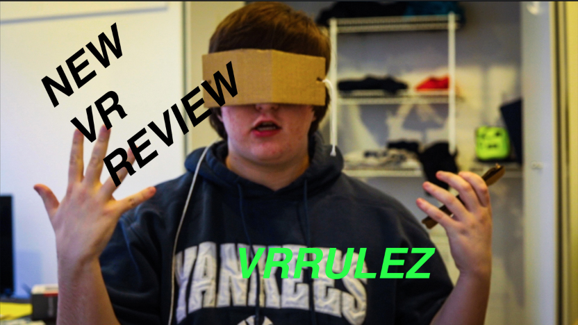

# Virtual Reality

The first piece of virtual reality hardware was created by Morton Heilig in 1962, a machine dubbed the “Sensorama” based off an earlier idea he had of an “Experience Theater” a theater meant to indulge all 5 senses.  However, the father of modern VR was Ivan Sutherland, who created the first head mounted VR display in 1968, calling it the “Sword of Damocles”.

The ideas behind VR have been present in society for a long time, the idea of a stereoscopic image has been in consumer products since 1939. The origins of the term are disputed however, due to certain ideas of virtual reality relating more to existence than technology. The first mention of the modern concept of VR came from science fiction.

In the early days, VR was mainly something used for training, such as flight simulation, military training, etc. During this time period some people were using VR for more creative endeavors, such as David Em producing the first navigable worlds in VR while working at NASA, or MIT undergrads producing the Aspen Movie Map, a VR space that gave the viewer a tour of Aspen, Colorado.

The 90s were meant to be the introduction of VR headsets to the consumer, and in a way that was correct. In 1991, Sega released Arcade VR, and VR for the Sega Genesis, and in the same year, the company Virtuality began producing large scale VR arcade machines, costing 73,000 dollars per pod. In 1995, Nintendo released the Virtual Boy, another VR headset, however both that and the Sega VR failed to take hold of the market like their other products, with the Virtual Boy having a lifespan of less than a year, selling under a million units, compared to the 3.6 million units the Nintendo 64 about a year later.

Perhaps due to the failures of Sega and Nintendo’s venture into VR, it lost interest in the public eye, not coming back until the debut of the Oculus Rift at e3 2012. Following a successful Kickstarter campaign, Oculus began sending out dev kits in 2013, following their purchase by Facebook for a rumored 3 billion dollars. Today, over 230 companies have VR departments, with ,major companies such as Sony and HTC releasing VR peripherals, and some even being available in stores like Target, or Walmart.

Time will only tell how big VR gets. As of now, the technology is interesting, but it has yet to develop a killer app of sorts, the software does not match the hardware in quality. Perhaps VR will spread into non gaming fields, such as education, medicine, or even other consumer areas such as films, television, and live sports.

